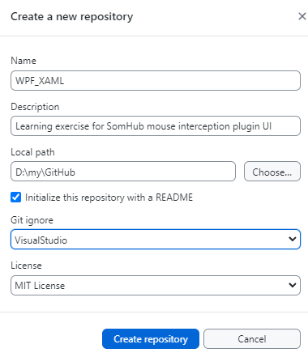
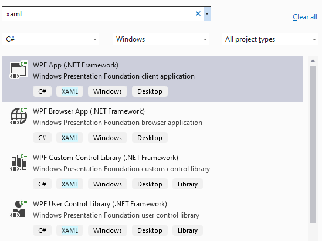
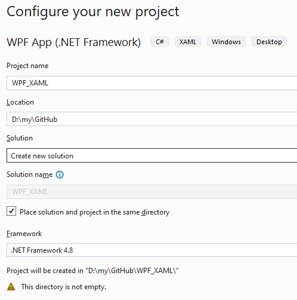
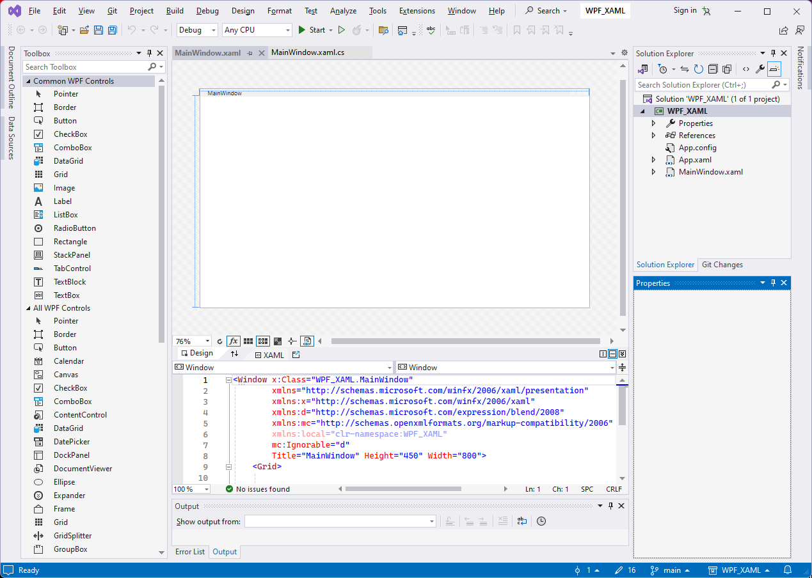
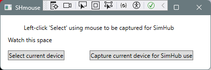

# WPF_XAML
 Learning exercise for [SimHub mouse interception plugin UI](https://blekenbleu.github.io/static/SimHub/VisualStudio.htm#XAML)  

This is the **main** branch;&nbsp; **intercept** branch will integrate mouse interception.

- *Created using GitHub Desktop* `File>New Repository..`  
   
- Then:&nbsp; Visual Studio 2022 Community `File>New`  
   
- *VS refused to create a new project in that new repository;*  
   
- *created new WPF App project in a subfolder, then moved its contents here*  
   

- Dragged WPF Controls (label, textbox and 2 button) from ToolBox into MainWindow  
	- named Controls and added content in `Properties`,  
		adjusted size and margin numbers in `MainWindow.xaml`  
	- Build and Debug:  
		
	- unlike [WinForm](https://github.com/blekenbleu/WinForm), double-clickng dragged Controls did not generate C# code  
		.. at least not at first, but did when tried later..?!!  
- Launching the app shows prompt in label, current device event in text box
	- left button armed to select mouse device
		- pressing will unhide second button to capture that selected mouse and change this button to deselect
	- right button, when visible,  will invoke Intercept() when clicked;  
		Intercept() will eventually [close the app](https://stackoverflow.com/questions/2820357/how-do-i-exit-a-wpf-application-programmatically).
